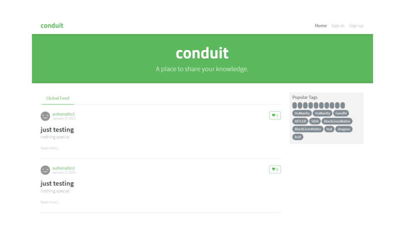
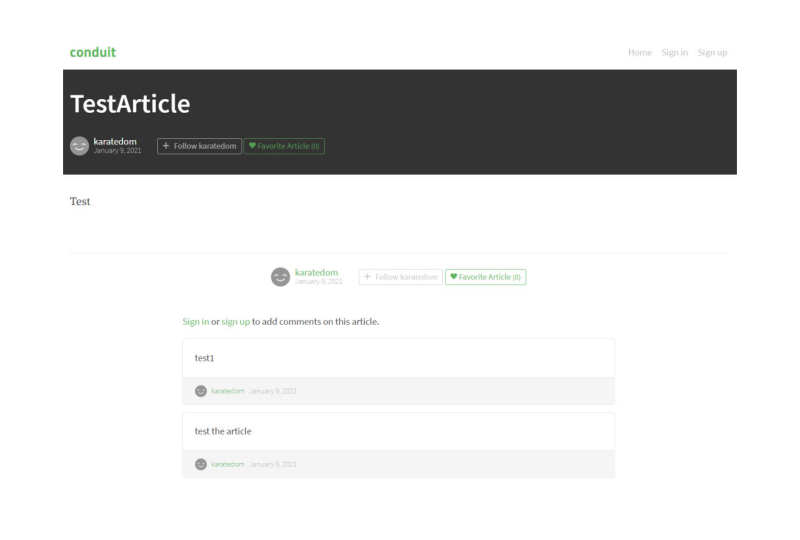
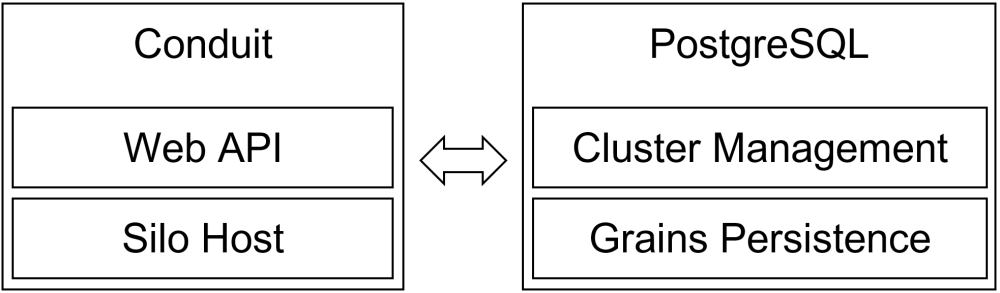

# 

> ### [Microsoft Orleans](https://dotnet.github.io/orleans/) codebase containing real world examples (CRUD, auth, advanced patterns, etc) that adheres to the [RealWorld](https://github.com/gothinkster/realworld) spec and API.

### What is [RealWorld](https://demo.realworld.io/)

[Realworld](https://demo.realworld.io/) is a simple content management system similar to Medium.com or Wordpress but is much simpler.
For live demo, please visit: **https://demo.realworld.io/**. Its basic features are:
1. signup & sigin users
2. CRUD articles
3. articles tags, favorite, comments

[Realworld](https://demo.realworld.io/) is built using SPA, having Frontend Web app and Backend Web API.
For further information, please visit [RealWorld Github](https://github.com/gothinkster/realworld).

#### Screenshots
Home page

Article Page

### [Demo](https://demo.realworld.io/)&nbsp;&nbsp;&nbsp;&nbsp;[RealWorld Github](https://github.com/gothinkster/realworld)

This **Work-In-Progress** codebase was created to demonstrate a fully fledged fullstack application built with [Microsoft Orleans](https://dotnet.github.io/orleans/) including CRUD operations, authentication, routing, pagination, and more.

We've gone to great lengths to adhere to the [Microsoft Orleans](https://dotnet.github.io/orleans/) community styleguides & best practices.

For more information on how to this works with other frontends/backends, head over to the [RealWorld](https://github.com/gothinkster/realworld) repo.

# How it works
This Web app is combining ASP.NET Core Web API and [Microsoft Orleans](https://dotnet.github.io/orleans/). 
ASP.NET Core is used as the Orleans Clients, so we need an Orleans Server and that is what [/src/SiloHost](https://github.com/rizaramadan/Conduitorleans/tree/main/src/SiloHost)
is for. 

For the ASP.NET Core Web API, some notable packages used (beside Orleans):
1. [Fluent validation](https://github.com/FluentValidation/FluentValidation)
2. [Microsoft JWT Bearer](https://github.com/aspnet/Security/tree/master/src/Microsoft.AspNetCore.Authentication.JwtBearer)
3. [Swashbuckle for ASP.NET Core](https://github.com/domaindrivendev/Swashbuckle.AspNetCore)
4. [Feature folder](https://github.com/OdeToCode/AddFeatureFolders)
5. [Npgsql](https://www.npgsql.org) for cluster client accessing cluster management table
6. [MediaTR](https://github.com/jbogard/MediatR) for thin controllers

note that ASP.NET Core Web API don't use ngpsql to access database directly in the logic, its only 
used for accessing cluster management table. 

For The Orleans implementation, some notes:
1. Postgresql is used for both AdoNet clustering and grains persistent provider
2. Related to grains persistent provider, the **payloadjson** column of **orleansstorage** table is changed from default TEXT to [JSONB](https://github.com/rizaramadan/Conduitorleans/blob/31d0abe5243349a402ece63acc9f8cf61a7dc69d/scripts/conduitorleans_all.sql#L491)
3. [Npgsql](https://www.npgsql.org) for direct query to database

Picture below ilustrate the relations of ASP.NET Core Web API, represented by **Conduit** and 
Orleans implementation, represented by **SiloHost** :

In the code base, we also try to adopt practice from Golang language regarding method return value being Error
is one of it. See https://golang.org/doc/tutorial/handle-errors. In C#, tuple is used to replicate similar practice.
This might be changed in the future, like removed altogether, but currently we are still unsure to continue or stop.
Leave it like this for the time being.

For more in-depth and complete example of Orleans sample, please look at [OneBoxDeployment](https://github.com/dotnet/orleans/tree/master/Samples/OneBoxDeployment)
or [road-to-orleans](https://github.com/PiotrJustyna/road-to-orleans).

# Getting Started
to have this up and running, steps are as follow:
1. clone this repository
2. prepare the database, as instructed in [/scripts/README.md](https://github.com/rizaramadan/Conduitorleans/blob/main/scripts/README.md)
3. build the solution
4. start [/src/SiloHost](https://github.com/rizaramadan/Conduitorleans/tree/main/src/SiloHost) project first, after its up and running
5. start the [/src/Conduit](https://github.com/rizaramadan/Conduitorleans/tree/main/src/Conduit)

# Work Progress Status
- [x] [Authentication](https://github.com/gothinkster/realworld/tree/master/api#authentication)
- [x] [Registration](https://github.com/gothinkster/realworld/tree/master/api#registration)
- [x] [Get current user](https://github.com/gothinkster/realworld/tree/master/api#get-current-user)
- [x] [Update user](https://github.com/gothinkster/realworld/tree/master/api#update-user). Implemented with limitation, that is user cannot change username. [More explanation here](https://github.com/rizaramadan/Conduitorleans/commit/5e3c57cbdf9f7bd601d9da0d6c1ba8fd992cd199)
- [x] [Get profile](https://github.com/gothinkster/realworld/tree/master/api#get-profile)
- [x] [Follow user](https://github.com/gothinkster/realworld/tree/master/api#follow-user)
- [x] [Unfollow user](https://github.com/gothinkster/realworld/tree/master/api#unfollow-user)
- [ ] [List articles](https://github.com/gothinkster/realworld/tree/master/api#list-articles)
    - [x] all articles
    - [x] article by tag    
    - [ ] favorited
    - [ ] by author
- [ ] [Feed articles](https://github.com/gothinkster/realworld/tree/master/api#feed-articles)
- [x] [Get article](https://github.com/gothinkster/realworld/tree/master/api#get-article)
- [x] [Create article](https://github.com/gothinkster/realworld/tree/master/api#create-article)
- [ ] [Update article](https://github.com/gothinkster/realworld/tree/master/api#update-article) 
- [ ] [Delete article](https://github.com/gothinkster/realworld/tree/master/api#delete-article)
- [ ] [Add comments to article](https://github.com/gothinkster/realworld/tree/master/api#add-comments-to-an-article)
- [ ] [Get comments from article](https://github.com/gothinkster/realworld/tree/master/api#get-comments-from-an-article)
- [ ] [Delete comment](https://github.com/gothinkster/realworld/tree/master/api#delete-comment)
- [ ] [Favorit article](https://github.com/gothinkster/realworld/tree/master/api#favorite-article)
- [ ] [Unfavorite article](https://github.com/gothinkster/realworld/tree/master/api#unfavorite-article)
- [x] [Get tags](https://github.com/gothinkster/realworld/tree/master/api#unfavorite-article)

### Footnote
Copy many codes from [an awesome conduit implementation using ASP.NET Core](https://github.com/gothinkster/aspnetcore-realworld-example-app).
Please check that repository, many things done right and much to learn from it.